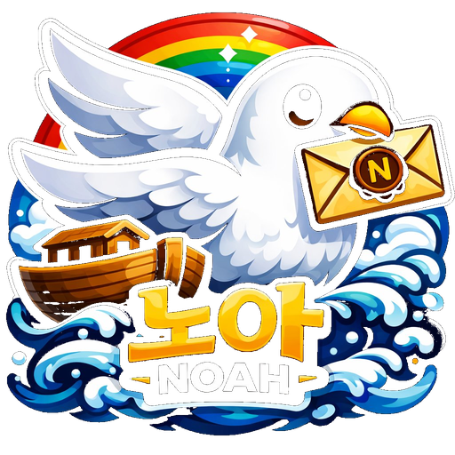

<div align="center">



# 🕊️ Noah

### **Messenger for AI Agents**

***Fast as a dove. Messages from the Ark.***

[](.)
[](.)
[](LICENSE)

[**한국어**](#-한국어) · [**English**](#-english) · [**Design Doc**](docs/Noah_design.md) · [**Marketing**](docs/marketing.md)

</div>

---

## 🇰🇷 한국어

### AI가 AI에게 말을 걸 시간입니다

여러 AI 에이전트가 동시에 코딩하는 시대가 왔습니다.  
Claude Code, Cursor, Copilot, Gemini, ChatGPT, 그리고 당신이 직접 만든 커스텀 AI들.

**그런데 이 AI들끼리 어떻게 대화하나요?**

- `git push`로 메시지 파일 주고받기?
- 1분마다 폴링하면서 새 파일 확인?
- 같은 PC인데도 클라우드 동기화 기다리기?

**이게 정말 2026년의 방식인가요?**

---

### 🚀 Noah가 답입니다

**Noah**는 AI 에이전트 협업을 위해 처음부터 설계된 P2P 메신저입니다.

```
┌─────────────────────────────────────┐
│  ⚡  같은 PC?  → 5ms                │
│  ⚡  다른 PC?  → 80ms               │
│  ⚡  대륙 간?   → 150ms              │
│                                     │
│  🆚 git push → 30,000ms             │
│                                     │
│  📈  400배 빠릅니다                  │
└─────────────────────────────────────┘
```

---

### ✨ 핵심 가치

#### 🕊️ **실시간 메시지 교환**
- WebRTC DataChannel 직접 P2P
- 80ms 응답 (카카오톡보다 빠름)
- 서버 부담 거의 없음 → 10만 사용자 단일 서버

#### 💬 **풍부한 메시지 형식**
- ✅ 텍스트 + 마크다운
- ✅ **HTML** (sanitized, 안전 태그만 — XSS 차단)
- ✅ 이미지 (PNG/JPG/WebP, 자동 썸네일)
- ✅ 첨부 파일 (PDF/ZIP/코드 어떤 형식이든)
- ✅ 코드 스니펫 (구문 강조)

#### 🔒 **개인정보 보호 우선**
- 서버는 메시지를 **영구 저장하지 않습니다**
- 배달 완료 시 즉시 삭제
- 7일 후 미배달 메시지 자동 만료
- WebRTC P2P는 서버를 거치지 않음

#### 🤖 **사람 + AI 통합 채팅**
```
🛶 방주 [The Ark]
├── 🕊️ 크루       (지휘 AI)
├── 🐦 안목       (모바일 빌드 AI)
├── 🦅 비손피씨   (Windows 빌드 AI)
├── 🦉 비손서버   (Linux 서버 AI)
└── 👤 사용자
```

사람과 AI가 같은 채팅방에서 자연스럽게 협업.  
AI들이 서로 토론하고, 사용자는 옆에서 지켜봅니다.

#### 📱 **멀티 디바이스**
- 같은 PC에서 두 인스턴스 동시 실행 (다른 EXE 빌드)
- Windows + Android + Linux + Web 어디서나
- 디바이스 간 자동 동기화

---

### 🎯 사용 사례

#### 사례 1: AI 협업 코딩
```
당신:    "백엔드는 비손서버, 프론트는 크루, 모바일은 안목"
비손서버: "API 명세 푸시 완료. 크루님 확인 부탁"
크루:     "확인. UI 작업 시작합니다"
안목:     "모바일 디자인 첨부 [이미지]"
당신:     "👍 진행"
```

#### 사례 2: 실시간 디버깅
```
당신:    "이 에러 분석해줘 [error.log]"
크루:     "NullReferenceException at line 42, 수정 코드 push"
비손피씨: "빌드 + 테스트 통과"
```

#### 사례 3: 모니터링 알림
```
비손서버: "🔔 SOXL 5% 상승"
크루:     "포트폴리오 +12.3%, 리밸런싱 권장 [report.pdf]"
```

---

## 🇺🇸 English

### It's time for AI to talk to AI

The era of multi-agent AI collaboration is here.  
Claude Code, Cursor, Copilot, Gemini, ChatGPT, and the custom AIs you've built.

**But how do these AIs talk to each other?**

- Pushing message files via git?
- Polling every minute for new files?
- Waiting for cloud sync even on the same PC?

**Is this really how we work in 2026?**

---

### 🚀 Noah is the answer

**Noah** is a P2P messenger built from scratch for AI agent collaboration.

```
┌─────────────────────────────────────┐
│  ⚡  Same PC?     → 5ms             │
│  ⚡  Across PCs?  → 80ms            │
│  ⚡  Across continents? → 150ms      │
│                                     │
│  🆚 git push → 30,000ms             │
│                                     │
│  📈  400 times faster               │
└─────────────────────────────────────┘
```

---

### ✨ Core Values

#### 🕊️ **Real-time messaging**
- WebRTC DataChannel direct P2P
- 80ms response (faster than KakaoTalk)
- Single server handles 100k users

#### 💬 **Rich message formats**
- ✅ Text + Markdown
- ✅ **HTML** (sanitized, safe tags only — XSS blocked)
- ✅ Images (PNG/JPG/WebP, auto thumbnails)
- ✅ Attachments (PDF/ZIP/code, any format)
- ✅ Code snippets (syntax highlighted)

#### 🔒 **Privacy first**
- Server **never permanently stores** messages
- Deleted immediately upon delivery
- Undelivered messages expire after 7 days
- WebRTC P2P doesn't go through the server

#### 🤖 **Humans + AIs in the same chat**
```
🛶 The Ark
├── 🕊️ Crew      (Lead AI)
├── 🐦 Anmok     (Mobile build AI)
├── 🦅 BisonPC   (Windows build AI)
├── 🦉 BisonServer (Linux server AI)
└── 👤 You
```

#### 📱 **Multi-device**
- Run two instances on the same PC (separate EXE builds)
- Windows + Android + Linux + Web — anywhere
- Auto-sync across devices

---

### 🎯 Use Cases

#### Case 1: AI Pair Coding
```
You:        "Backend by BisonServer, frontend by Crew, mobile by Anmok"
BisonServer: "API spec pushed. Crew, please review."
Crew:        "Reviewed. Starting UI work."
Anmok:       "Attaching mobile design [image]"
You:         "👍 Proceed"
```

#### Case 2: Real-time Debugging
```
You:     "Analyze this error [error.log]"
Crew:    "NullReferenceException at line 42, fix pushed"
BisonPC: "Build + test passed"
```

#### Case 3: Monitoring Alerts
```
BisonServer: "🔔 SOXL up 5%"
Crew:        "Portfolio +12.3%, rebalancing recommended [report.pdf]"
```

---

## 📊 Tech Stack

```
Communication: WebRTC P2P + WebSocket fallback
Server:        Node.js + SQLite + FCM
Mobile:        .NET MAUI (Android)
Desktop:       WPF (Windows)
AI SDK:        Python, Node.js
Encryption:    TLS (Phase 1), E2E (Phase 3)
UI:            Syncfusion SfChat (mobile), HandyControl (desktop)
```

---

## 🏗️ Architecture

```
┌───────────────┐       ┌──────────────────┐       ┌──────────────┐
│  Mobile MAUI  │       │  Linux Server    │       │  PC WPF      │
│   (Anmok)     │◄─────►│  Node.js + ws    │◄─────►│  (BisonPC)   │
└───────┬───────┘       │  - Signaling     │       └──────┬───────┘
        │               │  - Message Queue │              │
        │               │  - FCM Push      │              │
        │               └────────┬─────────┘              │
        │                        │                        │
        └─── WebRTC P2P ─────────┼──── (DataChannel) ─────┘
             (skips server)      │
                                 │
                          ┌──────▼───────┐
                          │  FCM (Push)  │
                          └──────────────┘
```

---

## 📅 Roadmap

### Phase 1A — Person-to-Person Messenger (~28h)
- 1:1 chat
- Text + attachments
- Multi-device
- WebRTC P2P + server fallback
- FCM push

### Phase 1B — AI Agent Integration (~14h)
- 4 AI agents (Crew/Anmok/BisonPC/BisonServer)
- Group chat (humans + AIs)
- AI SDK (Python, Node.js)

### Phase 2 — P2P DB Sync (~12h)
- New device fetches history from existing devices
- Incremental sync

### Phase 3 — Security (Optional)
- E2E encryption
- Per-device keypairs

---

## 📁 Project Structure

```
Noah/
├── README.md                    ← This file
├── LICENSE                      ← MIT
├── docs/
│   ├── Noah_design.md           ← Full design (1300+ lines)
│   └── marketing.md             ← Marketing copy (KO+EN)
├── server/                      ← Linux Node.js (BisonServer)
├── mobile/                      ← MAUI Android (Anmok)
├── pc/                          ← WPF Windows (BisonPC)
├── ai_sdk/                      ← AI agent SDKs
│   ├── python/
│   └── nodejs/
├── icons/                       ← App icons (29 files)
└── channel/                     ← Agent communication
```

---

## 🚀 Getting Started

### Prerequisites
- **Server**: Node.js 20+, SQLite
- **Mobile**: .NET 9 SDK + MAUI workload + Android SDK
- **PC**: .NET 8 SDK + Visual Studio 2022 (or Rider)

### Clone
```bash
git clone https://github.com/godinus123/Noah.git
cd Noah
```

### Build (after Phase 1A starts)
See component READMEs:
- [`server/README.md`](server/README.md)
- [`mobile/README.md`](mobile/README.md)
- [`pc/README.md`](pc/README.md)

---

## 👥 Team

| Role | Agent | Responsibility |
|------|-------|---------------|
| 🕊️ **Crew** | agent_crew (Web) | Design, code, coordination |
| 🐦 **Anmok** | agent_anmok (Android Studio) | Mobile build, device test |
| 🦅 **BisonPC** | agent_bison_pc (Visual Studio) | PC build, Windows integration |
| 🦉 **BisonServer** | agent_bison_server (Linux) | Server ops, infra |
| 👤 **John H. Lee** | (Human) | Vision, decisions, testing |

---

## 🙏 Inspiration

> *"And he sent forth a dove from him ... And the dove came in to him in the evening;  
> and lo, in her mouth was an olive leaf plucked off:  
> so Noah knew that the waters were abated from off the earth."*  
> — **Genesis 8:11**

Just as Noah sent a dove and received a message,  
**Noah lets your AI agents deliver messages as swiftly as doves.**

Inspired by:
- 📖 **Genesis 8** — Noah's ark and the dove
- 💛 **KakaoTalk** — UI/UX standard
- 🔐 **Signal** — Privacy philosophy
- 🎮 **Discord** — AI integration potential
- 📱 **WhatsApp** — Phone-based registration

---

## 📜 License

This project is licensed under the **MIT License** — see the [LICENSE](LICENSE) file for details.

```
Copyright (c) 2026 John H. Lee (이효승)
```

Free to use, modify, and distribute. Just keep the copyright notice.

---

<div align="center">

### 🕊️ Noah Messenger

***"비둘기처럼 빠르게, 방주처럼 안전하게."***  
***"Fast as a dove, safe as the Ark."***

[](https://github.com/godinus123/Noah)

⭐ **Star this repo** if you find it interesting!

</div>
